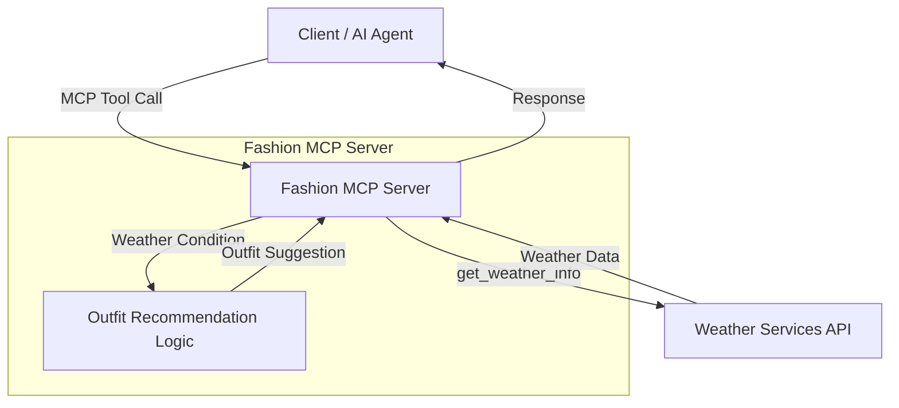

# Fashion Weather Recommender Server 🌦️👗

## Overview

This project is **a recommender system that checks the weather and accordingly suggests the appropriate clothing to go out and enjoy the day**.

It is implemented as a lightweight MCP (Model Context Protocol) server that:
- Fetches weather information from an external weather service
- Infers suitable outfit recommendations based on weather conditions
- Exposes tools that can be consumed by MCP-compatible clients

---

## Core Idea

> **"A recommender system that checks the weather and accordingly suggests the appropriate clothing to go out and enjoy the day."**

The server acts as a bridge between real-time weather data and simple outfit intelligence, making it easy to integrate weather-aware fashion suggestions into AI agents or applications.

---

## Features

- 🌤️ Fetch weather data from a weather services API  
- 👕 Recommend outfits based on weather conditions  
- 🧠 Designed to be extended with a smarter inference engine  
- 🔌 Exposes MCP tools over standard input/output  

---

## Architecture

---

## Technologies Used

- **Python**
- **FastMCP** – MCP server framework
- **httpx** – HTTP client for API calls
- **async/await** – Asynchronous execution

## **Configuration**

### **Weather Service API**

The server currently fetches weather data from:

```
WEATHER_SERVICES_API_URL = "http://localhost:8000/weather_services"
```

> ⚠️ This URL is a placeholder. Update it to point to your actual weather service.

---

## **Available MCP Tools**

### **get_weather_info**

Fetches weather details for a given location.

**Parameters**

* **location** (string): Name of the location

**Returns**

```
{
  "temperature": "<value>",
  "condition": "<weather condition>"
}
```

---

### **get_outfit_suggestions**

Provides outfit recommendations based on weather and occasion.

**Parameters**

* weather** (string): e.g. **sunny**, **rainy**, **cold
* occasion** (string): e.g. **casual**, **formal

**Returns**

```
{
  "outfit_suggestions": "I recommend wearing a light t-shirt and shorts."
}
```

---

## **Outfit Recommendation Logic**

Current logic is rule-based:

| **Weather** | **Recommendation**    |
| ----------------- | --------------------------- |
| sunny             | Light t-shirt and shorts    |
| rainy             | Waterproof jacket and boots |
| cold              | Warm coat and scarf         |
| other             | Comfortable clothing        |

> 🧠 Future versions can plug in an inference engine or ML model.

---

## **Running the Server**

```
uv --directory /path/to/breathable_fashion_recommender run fashion_server.py
```

You should see:

```
Starting fashion server!
```

The server will start listening over **stdio** for MCP requests.

